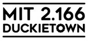
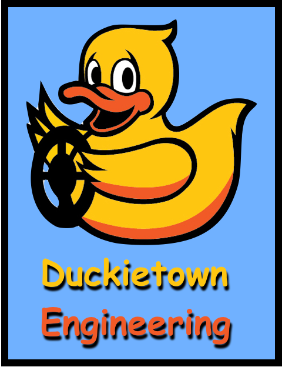
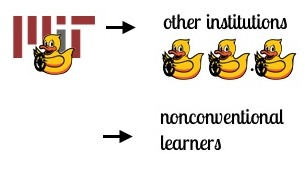
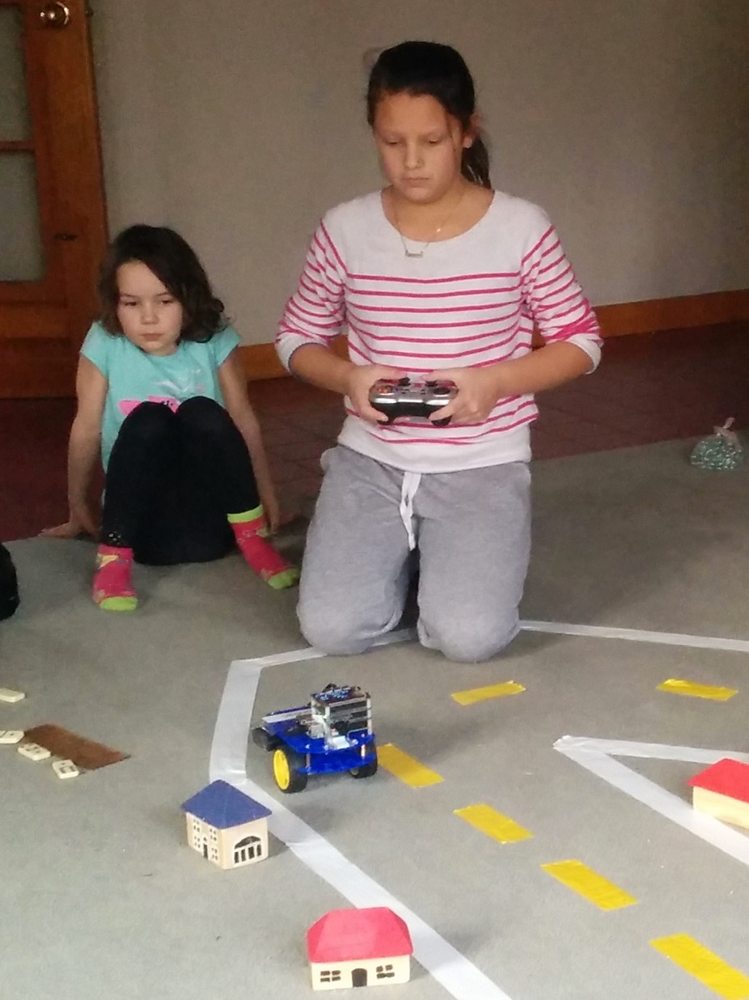
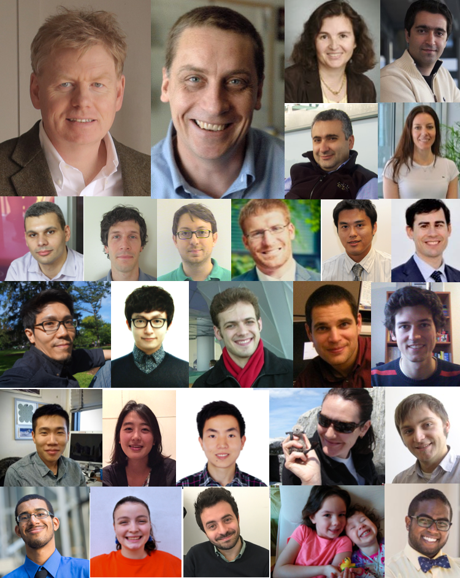

    <iframe width="560" height="315" src="https://www.youtube.com/embed/-TwocCeJUe8" frameborder="0" allowfullscreen>
        <!---->
    </iframe>

    

        

            <h3 class="black">Duckietown is </h3>
            <h3>an advanced autonomy class taught at MIT </h3>
            </img>
        

        
        

            <h3 class="black">Duckietown is </h3>
            <h3>a role play exercise</h3>
            </img>
        

        
        

            <h3 class="black">Duckietown is </h3>
            <h3>a research project</h3>
            </img>
        

    

    

    

        

            <h3 class="black">Duckietown is </h3>
            <h3>an "open source" and "reproducible" class</h3>
            </img>
        

        
        

            <h3 class="black">Duckietown is </h3>
            <h3>an outreach effort</h3>
            </img>
        

        
        

            <h3 class="black">Duckietown is </h3>
            <h3>a learning experience for everybody</h3>
            </img>
        

    

    

    <h2>Duckietown is a class on advanced autonomy taught at MIT</h2>

    For Spring 2016, MIT has a new class about the science of autonomy at the graduate level. This is a hands-on, project-focused course focusing on self-driving vehicles and high-level autonomy. 
    The problem: **Design the Autonomous Robo-Taxis System for the City of Duckietown.**

    <ul>
        <li>This is a class for <tt><strong>makers &amp;&amp; thinkers </strong></tt></li>
        <li>This is a <strong>collaborative</strong> effort: 2 Labs (<A href="http://www.csail.mit.edu/">CSAIL</A> and <a href="http://www.lids.mit.edu">LIDS</a>), 3 Departments (ME, AeroAstro, EECS), and over a dozen people helped created this class, under the supervision of Prof. <a href="http://marinerobotics.mit.edu/">John Leonard</a> and Prof. <a href="http://www.mit.edu/~jhow/">Jon How</a>.
        </li>
          <li><a href="https://docs.google.com/uc?id=0B9YU76UT5h3Fc2VmUFd1UlA1NUk&amp;export=download">
          Duckietown UROP opportunities
          </a></li>
          <li><strong><a href="staff.html">Staff</a></strong></li>

        <li><strong><a href="cool_videos.html">Cool videos</a></strong></li>

    </ul>

    <h2>Duckietown is a reproducible, open-source class </h2>

    <ul>
    <li>This is an <strong>open-source class</strong>: all materials (hardware design, software, and teaching materials) will be released as "open source" (a <a href="http://www.gnu.org/philosophy/free-sw.en.html">free software</a> license for code; a Creative Commons license for teaching materials)</li>
      
      <li><a href='updates.html'>News and updates</a></li>
      <li> Follow us on Facebook:   <a  href="http://facebook.com/duckietown">facebook.com/duckietown</a>.</li>
      <li><strong>Contacts:</strong> 
      Please <a href="mailto:duckietown@mit.edu">contact us at <tt>duckietown@mit.edu</tt></a> with any question.</li>
    </ul>

    <h2>Duckietown is an outreach effort</h2>
    
    

        Our Duckiebot ($100 platform):
        
    

 
    

        The roboticists of the future:
        

            <iframe src="https://player.vimeo.com/video/150075068" class="embed-responsive-item" frameborder="0" webkitallowfullscreen mozallowfullscreen allowfullscreen></iframe>
        

    

