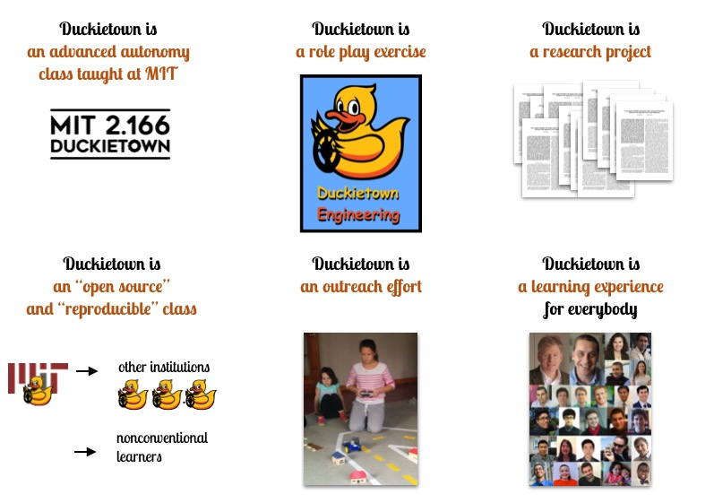
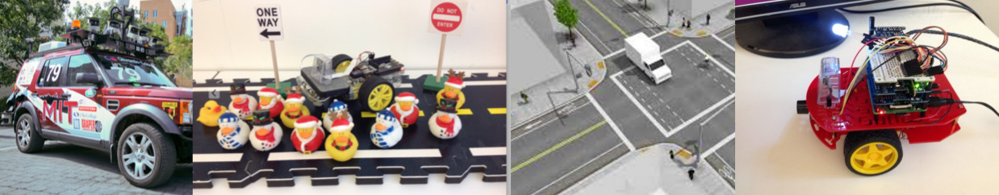

<!-- 
<h1 style="margin-top:-1em">MIT 2.166 - Autonomous Vehicles</h1>
 -->

<h2 style='font-size: 340%; text-align: center; text-shadow: 2px 2px black;'> What is Duckietown? </h2>

<h2>Duckietown is a class on advanced autonomy taught at MIT</h2>

For Spring 2016, MIT has a new class about the science of autonomy at the graduate level. This is a hands-on, project-focused course focusing on self-driving vehicles and high-level autonomy. 
The problem: **Design the Autonomous Robo-Taxis System for the City of Duckietown.**

<ul>
<li>This is a class for <tt><strong>makers &amp;&amp; thinkers </strong></tt></li>
<li>This is a <strong>collaborative</strong> effort: 2 Labs (<A href="http://www.csail.mit.edu/">CSAIL</A> and <a href="http://www.lids.mit.edu">LIDS</a>), 3 Departments (ME, AeroAstro, EECS), and over a dozen people helped created this class, under the supervision of Prof. <a href="http://marinerobotics.mit.edu/">John Leonard</a> and Prof. <a href="http://www.mit.edu/~jhow/">Jon How</a>.
</li>
  <li><a href="https://docs.google.com/uc?id=0B9YU76UT5h3Fc2VmUFd1UlA1NUk&amp;export=download">
  Duckietown UROP opportunities
  </a></li>
  <li><strong><a href="staff.html">Staff</a></strong></li>

<li><strong><a href="cool_videos.html">Cool videos</a></strong></li>

</ul>

<h2>Duckietown is a reproducible, open-source class </h2>

<ul>
<li>This is an <strong>open-source class</strong>: all materials (hardware design, software, and teaching materials) will be released as "open source" (a <a href="http://www.gnu.org/philosophy/free-sw.en.html">free software</a> license for code; a Creative Commons license for teaching materials)</li>
  
  <li><strong><a href='updates.html'>News and updates</a></strong>: follow us on Facebook:
  <a style='font-family: monospace; font-weight: bold' href="http://facebook.com/duckietown">facebook.com/duckietown</a>.</li>
  <li><strong>Contacts:</strong> 
  Please <a href="mailto:duckietown@mit.edu">contact us at <tt>duckietown@mit.edu</tt></a> with any question.</li>
</ul>

<!-- 

 -->

<!-- 
Backstory: Duckietown is a pleasant little town in the sovereign state of Duckieland. 

You moved to Duckietown last summer, after graduating from MIT. You were following the love of your life. You were working remotely for your friend’s social networking startup. Life was good, for a while. But things didn’t quite work out the way they were supposed to---the start-up went south and so did your love life. As the winter begins, you are now single and jobless in Duckietown.

In a fortuitous late-night encounter at a Karaoke bar, you meet a funny old man and you become best friends over saké. You learn that he is a high-ranking official in the Duckie Party. 
A couple of weeks later, the Duckieland Ministry of Transportation gives you the task of designing a mobility-on-demand system based on autonomous cars for the entire country of Duckieland. You have to build this system from scratch. 
 -->

<h2>Duckietown is an outreach effort</h2>

 

Our Duckiebot ($100 platform):

The roboticists of the future:

<iframe src="https://player.vimeo.com/video/150075068" width="500" height="281" frameborder="0" webkitallowfullscreen mozallowfullscreen allowfullscreen></iframe>

<!-- All these links are Google Docs documents 
on which everybody can comment:

- [Syllabus][syllabus]

[syllabus]: https://docs.google.com/document/d/1xkYod3ZepC3oMLTH-YCdMXlJRDWUQ8w14ROIh0yDsOE/edit -->

  <!-- <h1 class="page-heading">News</h1> -->

  <!-- <h2 style='margin-top: 5em'> News </h2> -->
  <ul class="post-list">
    
      <li>
        {{ post.date | date: "%Y-%m-%d" }}

        {{ post.title }}

        <!-- <a href="{{ post.url | prepend: site.baseurl }}">{{ post.title }}</a> -->
  
        {{ post.content }}
      </li>
    
  </ul>
<!-- 
  
subscribe <a href="{{ "/feed.xml" | prepend: site.baseurl }}">via RSS</a>
 -->
