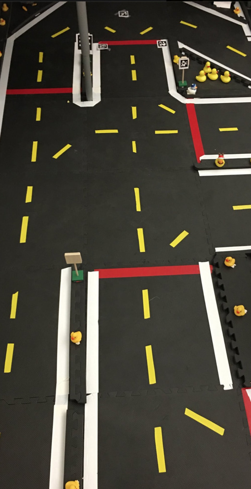

(In construction)

# Important documents for MIT students

* [Syllabus](https://docs.google.com/document/d/1xkYod3ZepC3oMLTH-YCdMXlJRDWUQ8w14ROIh0yDsOE/edit?usp=sharing)
* [Lecture plan]()
* [Calendar]()
* [What's in the boxes?]()
* [Account policy]()

Assignments:
* Module 
* Module 
* Module 
* Module 
* Module 
* Module 
* Module 

## How to build our reproducible Duckiebot 

* Setup Step 0 - Buy the parts.gddoc
* Setup Step 1 - Assembling the kit.gddoc
* Setup Step 1.1 - Reproducing the Ubuntu Image.gddoc
* Setup Step 1.2 - Traffic Light.gddoc
* Setup Step 1.5 - Burn the image.gddoc
* Setup Step 2 - From SD image to Remote RC control.gddoc
* Setup Step 2.1 Joystick + camera output in remote laptop.gddoc
* Setup Step 2.2 Camera Calibration.gddoc
* Setup Step 2.5 - First commit.gddoc
* Setup Step 2alternative - Virtualbox-Setup.gddoc
* Setup Step 3.0 Take a log.gddoc
* Setup Step 4 - Creating your own ROS package.gddoc
* Testing everything.gddoc
* Troubleshooting - Network troubleshooting checklist.gddoc

## How to build our reproducible Duckietown

## How to operate your Duckiebot

* Burning image
* Setup ROS
* Create Github points

# Class materials
*in construction*

Setup materials

        
           
            